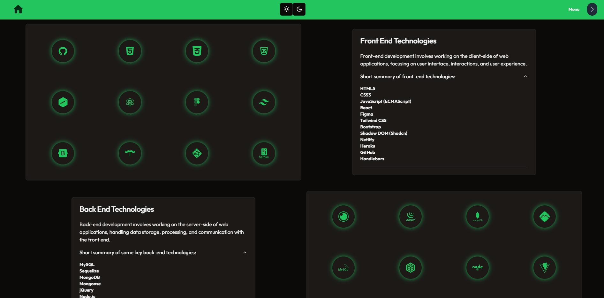

# John Walters Portfolio

```
Hello there and welcome! A fully responsive portfolio website showcasing the technologies I am proficient in using and a collection of my past works. Check it out! make sure to toggle the themes to your preference and feel free to contact me with the information provided on the site! My resume is available for download at your discretion as well. I look forward to hearing from you.

``` 

## Technologies Used

```
- React.js
- Tailwind CSS
- Shadow DOM (Shadcn)
- Three.js
- CSS3
- HTML5
- Vite
- Node.js
- JavaScript
- Netlify
```


### Screenshot Of Application 




### Link To Deployed Application

https://jwalters-portfolio.netlify.app/ 

### Link To Repository

https://github.com/waltscode/Shad_profile 